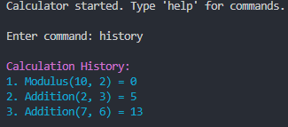
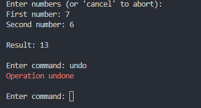
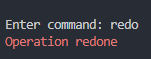

## Midterm Project

### How to run 
Create a virtual environment 
```
python3 -m venv venv
```

Activate virtual environment
```
source venv/bin/activate
```

Install dependencies
```
pip3 install -r requirements.txt
```

Create an .env file in the root directory with these environment variables
NOTE: these environment variables are optional and a default value will be used if 
the environment variable is not configured.
```
CALCULATOR_BASE_DIR=app
CALCULATOR_MAX_HISTORY_SIZE=100
CALCULATOR_AUTO_SAVE=true
CALCULATOR_MAX_INPUT_VALUE=1e999
CALCULATOR_PRECISION=10
CALCULATOR_DEFAULT_ENCODING=utf-8
CALCULATOR_LOG_DIR=logs
CALCULATOR_HISTORY_DIR=history
CALCULATOR_HISTORY_FILE=calculator_history.csv
CALCULATOR_LOG_FILE=calculator.log
```

Run main.py to execute program
```
python3 main.py
```

Calculator Commands
```
help - Displays the help menu
add, subtract, multiply, divide, power, root, modulus, int_divide, 
percent, abs_diff - Perform calculations
history - Show calculation history
clear - Clear calculation history
undo - Undo the last calculation
redo - Redo the last undone calculation
save - Save calculation history to file
load - Load calculation history from file
exit - Exit the calculator
```

Run tests by running the pytest command

GitHub Actions
In the .github/workflows directory there is a yaml file called python-app.yml. This file is the configuration
of the GitHub Action workflow. This workflow enforces 100% unit test coverage in the main branch 
if the test coverage is under 100% the job fails. When there is a push to the main branch or a pull request to the 
main branch the workflow check to see if the test coverage is still at 100%.

### Enhancements
Using the colorama library, I added some coloring for the REPL output for the help command, undo command, 
redo command, exit command, and error message for unknown operation.

### Screenshots
History



Help Menu


Undo command



Redo command



Exit command


Unknown Operation Error

